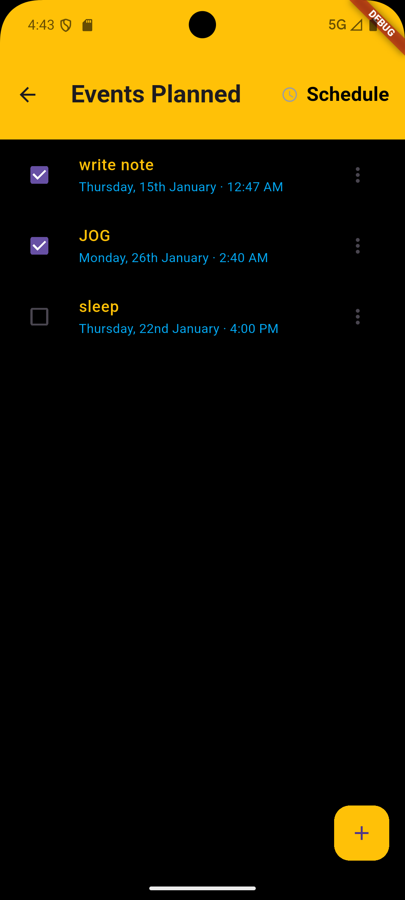
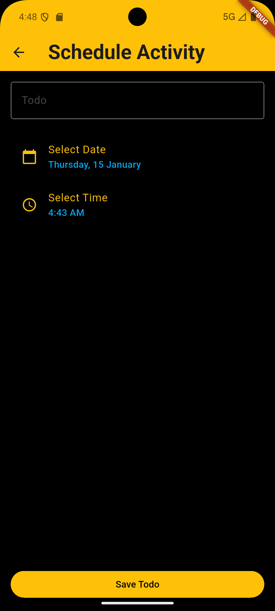
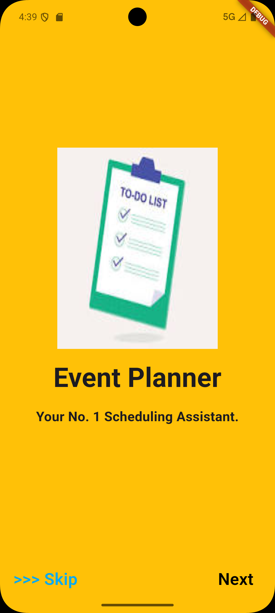
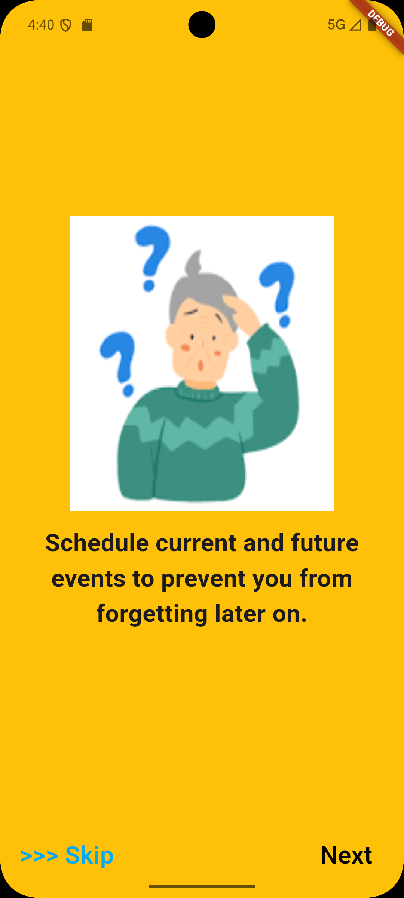
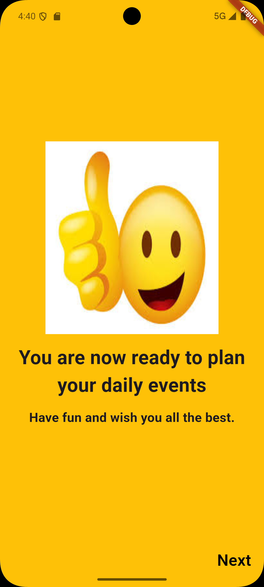

# Event Planner App Overview
This is an app designed to allow users plan events for both current and future uses. The user cannot be allowed to place events on previous dates and can also modify currently placed dates

# Screenshots of the app

## 1. Event planning page
This page stores the events that have been set together with their corresponding dates and times

## 2. Custom Event page
This Page allows the user to set events with a specific date. It must not be the current date, it can be any day aside from previous days

## 3. Introduction Pages 
These are just little design pages that give small information about the app.

---

---

